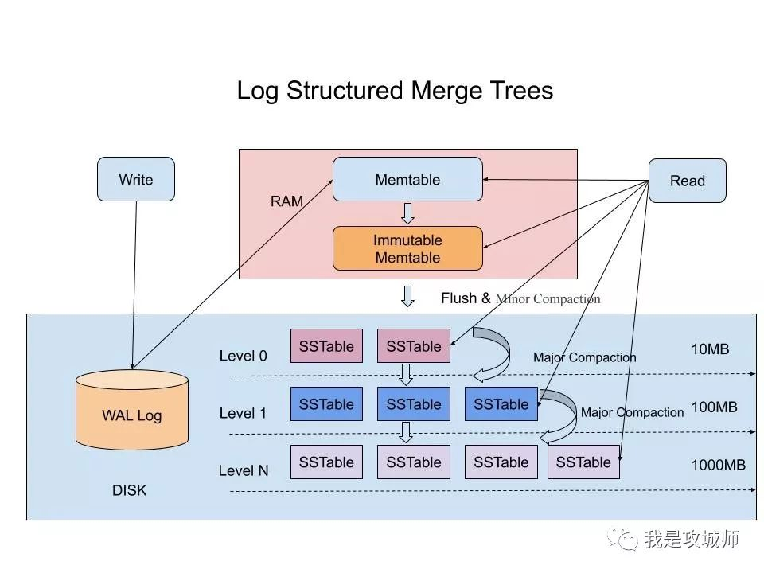

## 对比B-Tree和LSM-Tree

尽量B tree的实现比LSM tree的实现更为成熟，然而由于LSM tree的性能特点，LSM目前很有吸引力。根据经验，LSM tree通常对于写入更快，而B tree被认为对于读取更快。读取通常在LSM tree上较慢，因为它们必须在不同的压缩阶段检查多个不同的数据结构和SSTable

LSM tree是一种分层，有序，面向磁盘的数据结构，其核心思想是充分了利用了，磁盘批量的顺序写要远比随机写性能高出很多

在LSM-Tree里面，核心的数据结构就是SSTable，全称是Sorted String Table

- WAL (Write ahead log)
- MemTable  这个就是C0-Tree的内存中对应的数据结构，这个树是什么结构，其实LSM并没有强约束，我们可以是红黑树，也可以是跳表
- Immutable MemTable 当C0-Tree达到内存设置的阈值的时候，我们需要将数据进行落盘，但是咋ixie的时候，总不能阻塞外面的写请求。所以我们会先将MemTable转变为一个不可变的 Immutable MemTable，用来数据持久化。同时创建一个新的MemTable来处理新的写请求
- SSTable 这个是LSM tree在磁盘中的数据结构，是一个有序键值对集合

写入流程：

1. 先将写入操作append到wal日志里面
2. 将该数据存储到内存的memtable中，该表的实现可以是红黑树或跳表
3. 当memtable达到阈值的时候，会将该部分数据形成快照，并新生产一个memtable用来处理后续的请求
4. 将immutable memtable持久化到磁盘的sstable中，该步骤也叫Minor Compaction，数据会先会合并到L0层，然后每层的SS Table达到阈值的时候也会不断的向下合并 Major COmpaction，这个阶段清除掉被标记删除掉的数据以及多版本数据的合并，避免浪费空间，因为SSTable都是有序的，我们一般采用Merge Sort进行合并。

读取流程：

1. 先查询memtable以及immutable memtable，找到就返回内存中的（毕竟内存中是最新的）
2. 如果没有找到，则向下到sstable level 0 层开始查询，如果还是找不到，就继续往下面更深的层次sstable中查找，直到找到 或者找不到进行返回

LSM通过一些方式来优化其缺陷的读性能，因为我们不能像B+树那样照一次就能确定，很有可能要不断的下推查找。

- 布隆过滤器，带随机概率的bitmap，可以直接确定元素不存在
- compact：小树合并为大树，太多的小树，就会对应查太多的文件，所以定期将小树合并大树上可以有效的减少查询次数

1）读放大:读取数据时实际读取的数据量大于真正的数据量。例如在LSM树中需要先在MemTable查看当前key是否存在，不存在继续从SSTable中寻找。

2）写放大:写入数据时实际写入的数据量大于真正的数据量。例如在LSM树中写入时可能触发Compact操作，导致实际写入的数据量远大于该key的数据量。

3）空间放大:数据实际占用的磁盘空间比数据的真正大小更多。上面提到的冗余存储，对于一个key来说，只有最新的那条记录是有效的，而之前的记录都是可以被清理回收的。

SSTable是一种拥有持久化，有序且不可变的的键值存储结构，它的key和value都是任意的字节数组，并且了提供了按指定key查找和指定范围的key区间迭代遍历的功能。SSTable内部包含了一系列可配置大小的Block块，典型的大小是64KB，关于这些Block块的index存储在SSTable的尾部，用于帮助快速查找特定的Block。当一个SSTable被打开的时候，index会被加载到内存，然后根据key在内存index里面进行一个二分查找，查到该key对应的磁盘的offset之后，然后去磁盘把响应的块数据读取出来。当然如果内存足够大的话，可以直接把SSTable直接通过MMap的技术映射到内存中，从而提供更快的查找。

在LSM-Tree里，SSTable有一份在内存里面，其他的多级在磁盘上，如下图是一份完整的LSM-Tree图示

我们总结下在在LSM-Tree里面如何写数据的？

1，当收到一个写请求时，会先把该条数据记录在WAL Log里面，用作故障恢复。

2，当写完WAL Log后，会把该条数据写入内存的SSTable里面（删除是墓碑标记，更新是新记录一条的数据），也称Memtable。注意为了维持有序性在内存里面可以采用红黑树或者跳跃表相关的数据结构。

3，当Memtable超过一定的大小后，会在内存里面冻结，变成不可变的Memtable，同时为了不阻塞写操作需要新生成一个Memtable继续提供服务。

4，把内存里面不可变的Memtable给dump到到硬盘上的SSTable层中，此步骤也称为Minor Compaction，这里需要注意在L0层的SSTable是没有进行合并的，所以这里的key range在多个SSTable中可能会出现重叠，在层数大于0层之后的SSTable，不存在重叠key。

5，当每层的磁盘上的SSTable的体积超过一定的大小或者个数，也会周期的进行合并。此步骤也称为Major Compaction，这个阶段会真正 的清除掉被标记删除掉的数据以及多版本数据的合并，避免浪费空间，注意由于SSTable都是有序的，我们可以直接采用merge sort进行高效合并。

接着我们总结下在LSM-Tree里面如何读数据的？

1，当收到一个读请求的时候，会直接先在内存里面查询，如果查询到就返回。

2，如果没有查询到就会依次下沉，知道把所有的Level层查询一遍得到最终结果。

思考查询步骤，我们会发现如果SSTable的分层越多，那么最坏的情况下要把所有的分层扫描一遍，对于这种情况肯定是需要优化的，如何优化？在 Bigtable 论文中提出了几种方式：

1，压缩

SSTable 是可以启用压缩功能的，并且这种压缩不是将整个 SSTable 一起压缩，而是根据 locality 将数据分组，每个组分别压缩，这样的好处当读取数据的时候，我们不需要解压缩整个文件而是解压缩部分 Group 就可以读取。

2，缓存

因为SSTable在写入磁盘后，除了Compaction之外，是不会变化的，所以我可以将Scan的Block进行缓存，从而提高检索的效率

3，索引，Bloom filters

正常情况下，一个读操作是需要读取所有的 SSTable 将结果合并后返回的，但是对于某些 key 而言，有些 SSTable 是根本不包含对应数据的，因此，我们可以对每一个 SSTable 添加 Bloom Filter，因为布隆过滤器在判断一个SSTable不存在某个key的时候，那么就一定不会存在，利用这个特性可以减少不必要的磁盘扫描。

4，合并

这个在前面的写入流程中已经介绍过，通过定期合并瘦身， 可以有效的清除无效数据，缩短读取路径，提高磁盘利用空间。但Compaction操作是非常消耗CPU和磁盘IO的，尤其是在业务高峰期，如果发生了Major Compaction，则会降低整个系统的吞吐量，这也是一些NoSQL数据库，比如Hbase里面常常会禁用Major Compaction，并在凌晨业务低峰期进行合并的原因。

### **B+Tree VS LSM-Tree**

传统关系型数据采用的底层数据结构是B+树，那么同样是面向磁盘存储的数据结构LSM-Tree相比B+树有什么异同之处呢？

LSM-Tree的设计思路是，将数据拆分为几百M大小的Segments，并是顺序写入。

B+Tree则是将数据拆分为固定大小的Block或Page, 一般是4KB大小，和磁盘一个扇区的大小对应，Page是读写的最小单位。

在数据的更新和删除方面，B+Tree可以做到原地更新和删除，这种方式对数据库事务支持更加友好，因为一个key只会出现一个Page页里面，但由于LSM-Tree只能追加写，并且在L0层key的rang会重叠，所以对事务支持较弱，只能在Segment Compaction的时候进行真正地更新和删除。

因此LSM-Tree的优点是支持高吞吐的写（可认为是O（1）），这个特点在分布式系统上更为看重，当然针对读取普通的LSM-Tree结构，读取是O（N）的复杂度，在使用索引或者缓存优化后的也可以达到O（logN）的复杂度。

而B+tree的优点是支持高效的读（稳定的OlogN），但是在大规模的写请求下（复杂度O(LogN)），效率会变得比较低，因为随着insert的操作，为了维护B+树结构，节点会不断的分裂和合并。操作磁盘的随机读写概率会变大，故导致性能降低。

还有一点需要提到的是基于LSM-Tree分层存储能够做到写的高吞吐，带来的副作用是整个系统必须频繁的进行compaction，写入量越大，Compaction的过程越频繁。而compaction是一个compare & merge的过程，非常消耗CPU和存储IO，在高吞吐的写入情形下，大量的compaction操作占用大量系统资源，必然带来整个系统性能断崖式下跌，对应用系统产生巨大影响，当然我们可以禁用自动Major Compaction，在每天系统低峰期定期触发合并，来避免这个问题。

阿里为了优化这个问题，在X-DB引入了异构硬件设备FPGA来代替CPU完成compaction操作，使系统整体性能维持在高水位并避免抖动，是存储引擎得以服务业务苛刻要求的关键。

### LSM tree的优点 Log Structured-Merge Tree

B tree索引必须至少写两次数据：一次写入预写日志，一次写入树的页本身（还可能发生页分裂）。即使该页中只有几个字节更改，也必须承受写整个页的开销。

LSM通常能够承受比B tree更好的写入吞吐量，部分是因为它们有时具有较低的写放大，部分原因是它们以顺序方式写入紧凑的SSTable文件，而不必重写树中的多个页，这种差异对于磁盘驱动器尤为重要，原因是磁盘的顺序写比随机写要快得多

LSM可以支持更好的压缩，因此通常磁盘上的文件比B tree小很多。由于碎片，B tree存储引擎使某些磁盘空间无法使用：当页被分裂或者当一行的呢日哦那个不能适合现有页时，页中的某些空间无法使用。由于LSM不是面向页的，并且定期重写 SSTable以消除碎片化，所以它们具有较低的存储凯西奥，特别是在使用分层压缩时。

LSM对比BTree具有更低的写放大，和碎片减少，再以更紧凑的方式表示数据，从而可以在 IO带宽中支持很多的读写请求。

### LSM的缺点

日志存储结构的缺点是压缩过程中有时会干扰正在进行的读写操作。

高写入吞吐量时，压缩的另一个问题就会冒出来：磁盘的有限写入带宽需要在初始写入（记录并刷新内存表到磁盘）和后台运行的压缩线程之间所共享。写入空数据库时，全部的磁盘带宽可用于初始写入，但数据库的数据量越大，压缩所需的磁盘带宽就越多。

如果写入吞吐量很高并且压缩没有仔细配置，那么就会发生压缩无法匹配新数据写入速率的情况。在这汇总情况下，磁盘上未合并段的数量不断增加，直到磁盘空间不足，由于它们需要检查更多的段文件，因此读取速度也会降低，通常，即使压缩不能跟上，基于SSTable的存储引擎也不会限制到来的写入速率，因此需要额外的监控措施来及时发现这种情况。

B的优点是每个键都恰好唯一对应索引中的某个位置，而日志结构的存储引擎可能在不同的段中具有相同键的多个副本。如果数据库希望提供强大的事务语义，这方面Btree更具有吸引力：在许多关系数据库中，事务隔离是通过键范围上的锁来实现的，并且在Btree索引中，这些锁可以直接定义到·树中。

LSM树是非常值得了解的知识，理解了LSM树可以很自然地理解Hbase，LevelDb等存储组件的架构设计。ClickHouse中的MergeTree也是LSM树的思想，Log-Structured还可以联想到Kafka的存储方式。
